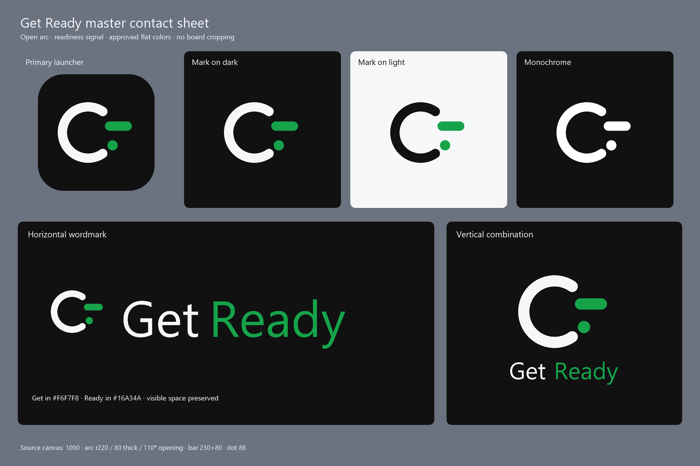
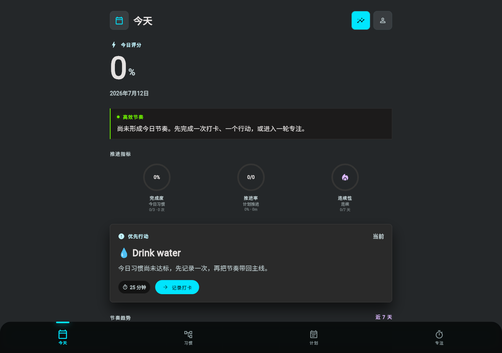
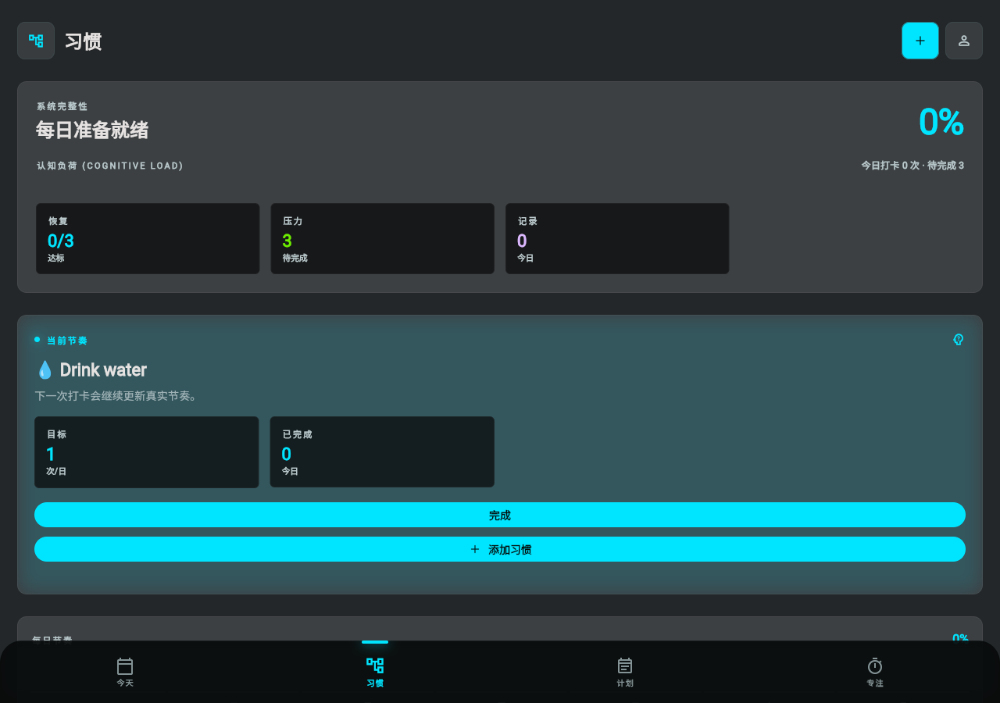
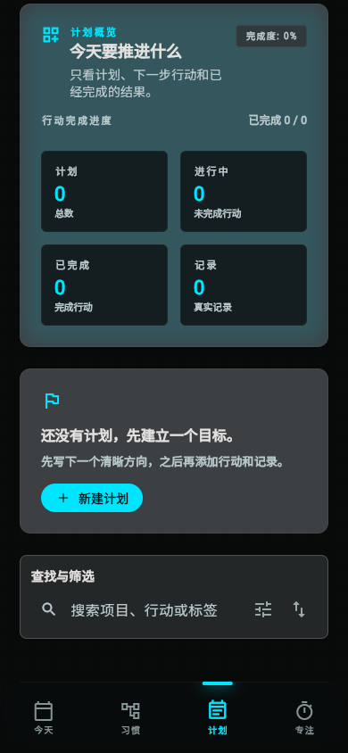
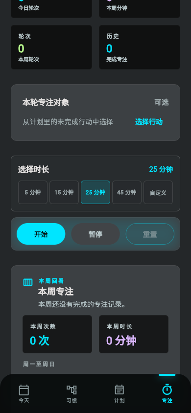
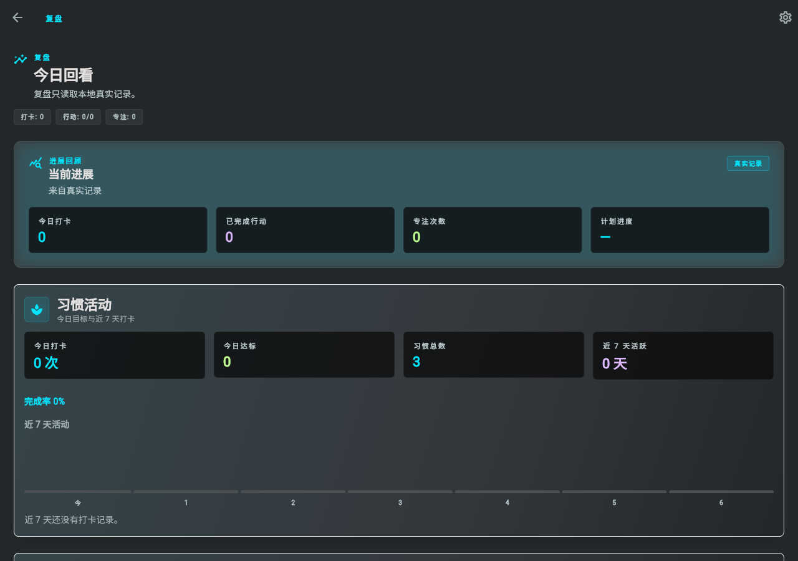
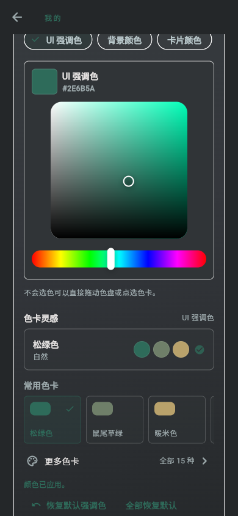
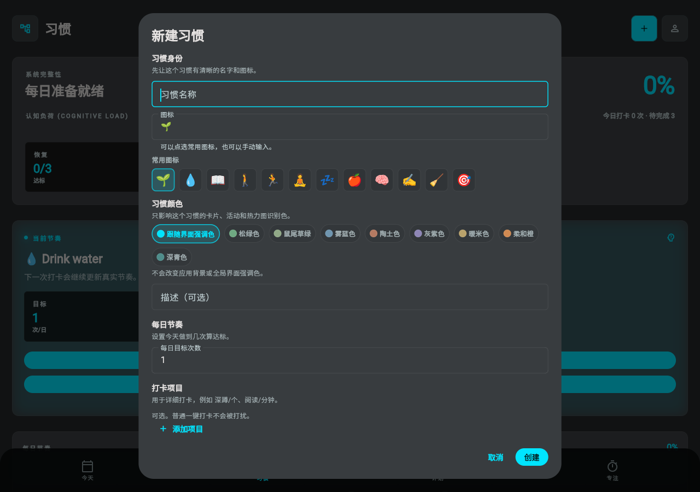

<p align="center">
  
</p>

<h1 align="center">Get Ready</h1>

<p align="center"><strong>随时准备，迎接每一次机会。</strong></p>

<p align="center">
  一款 local-first 的 Flutter 个人效率应用，把习惯养成、计划推进、专注执行、复盘洞察与 Android 提醒整合在同一条成长闭环中。
</p>

<p align="center">
  
  
  
  
  
</p>

当前应用版本为 **2.6.0**，Android build number 为 **18**。包标识继续保留为 `com.example.four_in_one_app`。

## 产品概览

Get Ready 面向希望把长期目标与每日行动连接起来的个人用户。应用围绕真实本地数据组织七个互相协作的产品区域：

- **今天**：聚合当天习惯、计划行动与专注数据，给出简洁的优先执行入口。
- **习惯**：创建和维护习惯，记录打卡、提醒、统计、生命周期与证明图片。
- **计划**：用目标、项目、子项目和行动组织长期推进过程。
- **专注**：选择计划行动作为目标，运行可恢复的倒计时并保留会话历史。
- **复盘**：从真实习惯、计划和专注记录派生只读指标，不展示伪造趋势。
- **通知与权限**：管理 Android 通知授权、渠道状态、测试通知与系统设置入口。
- **主题与个性化**：切换主题模式，并调整强调色、背景色和卡片色。

所有核心数据优先保存在设备本地。应用当前不要求账号，也不依赖云端后端。

## 核心功能

### 今天与跨页面同步

- 从 `HabitsStore`、`GoalsStore` 和 `FocusStore` 汇总当天状态。
- 展示习惯完成度、行动推进、专注分钟和近期节奏。
- 习惯打卡、计划行动完成和专注结束后，相关页面立即读取同一份 Store 状态。
- 主导航覆盖今天、习惯、计划和专注；复盘与设置作为可返回的次级页面。

### 习惯

- 创建和编辑名称、图标、描述、每日目标次数与独立颜色。
- 支持同一天多次打卡、补打、跳过以及可选的记录说明。
- 支持最多三条提醒规则，可配置时间、星期与启用状态。
- 提供近 7 天活动、月度/年度热力视图、连续天数、完成率和记录历史。
- 支持暂停、归档、恢复与保留历史的软删除生命周期。
- 记录可附加本地证明图片，并安全处理缺失文件。
- 可关联一个 Plan 项目或行动；达到当日目标后写入可追踪的来源记录，但不会替用户完成计划行动。

### 计划

- 使用 **目标 → 项目 → 子项目 → 行动** 的层级组织工作。
- 行动是唯一可直接完成的执行单元，父级进度由子行动派生。
- 项目与行动支持截止日期、优先级和标签。
- 提供搜索、筛选、排序、活动筛选标签与清晰的空状态入口。
- `PlanRecord` 支持说明、数值和图片记录，并保留行动或习惯来源信息。
- 项目详情提供记录表、进度、活动日期与轻量统计视图。

### 专注

- 提供 5、15、25、45 分钟预设和 1–180 分钟自定义倒计时。
- 可选择未完成的计划行动作为本轮专注目标；运行中保持目标快照稳定。
- 支持开始、暂停、继续、重置以及应用重启后的活动会话恢复。
- 完成会话后写入本地历史，并形成周概览和近期活动。
- Android 上使用普通、非精确提醒通知专注结束，不申请精确闹钟或前台服务权限。

### 复盘

- 汇总当天习惯打卡、完成行动、计划进度和专注会话。
- 区分正常打卡、补打与跳过记录，避免错误计入完成数据。
- 所有指标来自现有本地 Store 和记录，不使用演示趋势或远程分析服务。

### 通知、权限与个性化

- Android 13+ 仅在用户启用提醒、开始需要完成提醒的专注或主动触发权限操作时请求通知权限。
- Habit 与 Focus 使用独立且稳定的通知渠道，支持正文点击、可信动作和冷启动路由。
- Settings 中展示通知权限、渠道可用性、待处理提醒和普通提醒精度。
- Theme Studio 支持主题模式、常用色卡、完整色卡、HEX/RGB/ARGB 输入和独立重置。

## 截图

> 应用界面图来自经过交互检查的 Flutter browser QA 构建，不代表 Android 实机外观。Android 启动器、系统 Splash 与通知阴影仍需物理设备复核。

### Get Ready 品牌



### 主要页面

<table>
  <tr>
    <td align="center"><strong>今天</strong><br></td>
    <td align="center"><strong>习惯</strong><br></td>
  </tr>
  <tr>
    <td align="center"><strong>计划</strong><br></td>
    <td align="center"><strong>专注</strong><br></td>
  </tr>
  <tr>
    <td align="center"><strong>复盘</strong><br></td>
    <td align="center"><strong>设置与主题</strong><br></td>
  </tr>
</table>

<details>
<summary>查看新建习惯交互</summary>



</details>

截图来源、视口与使用边界见 [docs/screenshots/README.md](docs/screenshots/README.md)。

## 设计系统

### 品牌身份

Get Ready 的主标志由一个向右开放的圆弧、一条绿色圆角状态栏和状态栏下方的绿色圆点组成。它表达开放、准备、专注、行动、进步与机会；不再使用旧三阶图形。

| 角色 | 颜色 | 用途 |
| --- | --- | --- |
| Ink black | `#111111` | 主文字、深色品牌背景 |
| Brand green | `#16A34A` | 状态、行动与 `Ready` 品牌强调 |
| Deep gray | `#6B7280` | 次级文字与说明 |
| Light gray | `#E5E7EB` | 分隔、浅色边界 |
| Background gray | `#F6F7F8` | 浅色背景 |

### 界面方向

- 深色、克制、高对比的 premium UI 是当前主要视觉方向，同时保留主题切换和颜色个性化。
- 主页面强调清晰层级、足够留白和直接行动，不以大量装饰或连续动画制造注意力负担。
- 主页面常用水平边距约 22 px；大区块间距 24–30 px；关联控件间距 12–16 px；卡片内边距 18–24 px。
- 常用交互目标保持约 48 × 48 px；短反馈通常使用 160 ms，进度变化通常使用约 240 ms。
- 动效服务于状态和层级变化，不增加人工加载延迟。

完整品牌规则见 [docs/BRAND.md](docs/BRAND.md)。

## 技术栈

| 技术/依赖 | 当前用途 |
| --- | --- |
| Flutter | 跨平台 UI、路由与应用生命周期 |
| Dart | 应用、领域与测试代码 |
| `shared_preferences` | 习惯、计划、专注与设置的本地结构化持久化 |
| `flutter_local_notifications` | Habit 与 Focus 的本地通知、渠道、调度和响应 |
| `timezone` | 按设备时区构造通知日历时间 |
| `image_picker` | 用户主动选择图片或调用外部系统相机 |
| `image_picker_android` / `image_picker_platform_interface` | Android Photo Picker 与可测试的平台抽象 |
| `path_provider` | 定位应用管理的本地附件目录 |
| `flutter_test` | unit、widget、跨 Store 与平台契约测试 |
| `flutter_lints` | Dart/Flutter 静态规则 |

准确版本约束见 [pubspec.yaml](pubspec.yaml)，解析后的依赖见 `pubspec.lock`。项目没有引入大型状态管理、数据库、网络后端或分析 SDK。

当前仓库没有 `web/` 或 `windows/` 平台目录，因此文档不声明 Web 或 Windows 为可运行发布目标；现有 browser 截图仅用于 Flutter UI QA。

## 架构

应用采用 feature-first 目录与轻量分层：

1. **Presentation**：页面、对话框、Bottom Sheet 和共享组件读取 Store 并提交用户动作。
2. **Application/Stores**：`HabitsStore`、`GoalsStore`、`FocusStore`、`AppSettingsStore` 维护内存状态、派生指标和操作顺序。
3. **Domain models**：习惯、记录、计划层级、专注会话等模型保持业务语义稳定。
4. **Local persistence**：结构化状态写入 `shared_preferences`；图片复制到应用管理目录。
5. **Notifications**：统一通知服务负责初始化、渠道、调度、健康信息与响应；Habit/Focus 适配器保留各自语义。
6. **Permissions**：权限协调器把 Android 原生状态映射为结构化结果，UI 根据结果解释、请求或打开设置。
7. **Routing**：现有命名路由连接 Today、Habits、Plan、Focus、Review 与 Settings；通知负载只能进入允许的现有页面。
8. **Tests**：unit tests 覆盖 Store、持久化和平台契约；widget/integration-style tests 覆盖真实交互和跨页同步。

详见 [docs/ARCHITECTURE.md](docs/ARCHITECTURE.md)。

## 数据与隐私

- **Local-first**：核心结构化数据和附件保存在当前设备。
- **无账号**：没有注册、登录、身份系统或个人资料服务。
- **无云后端**：没有远程数据库、云同步或服务器 API。
- **无分析**：没有行为分析、广告归因或遥测 SDK。
- **无广告**：没有广告网络或商业追踪组件。
- **用户选择的媒体**：图片通过系统 Photo Picker、系统文档选择器或外部相机意图获得；应用不申请广域媒体库权限。
- **最小权限**：没有相机、麦克风、位置、联系人、短信、电话、广域存储、精确闹钟或前台服务权限。

当前数据仅适合单设备使用。卸载应用、清除应用数据或设备损坏可能导致数据丢失；导出/备份仍在路线图中。

## Android 权限

| 权限 | 变体 | 原因 |
| --- | --- | --- |
| `POST_NOTIFICATIONS` | main/release | Android 13+ 显示 Habit 和 Focus 通知；只在上下文中请求 |
| `RECEIVE_BOOT_COMPLETED` | main/release | 允许插件在重启或应用更新后恢复真实已调度提醒 |
| `VIBRATE` | main/release（依赖合并） | 支持普通通知渠道提示行为 |
| `INTERNET` | debug/profile only | Flutter 调试工具通信；release 合并清单不包含 |

AndroidX 还会生成一个仅限当前包、签名级保护的 `DYNAMIC_RECEIVER_NOT_EXPORTED_PERMISSION`，用于保护非导出动态接收器；它不是危险权限，也不扩大产品数据访问。

完整权限边界、通知渠道、拒绝回退和设备检查清单见 [docs/ANDROID_NOTIFICATIONS.md](docs/ANDROID_NOTIFICATIONS.md)。

## 如何运行

前置条件：Windows PowerShell、兼容的 Flutter SDK、Android SDK（运行 Android 时）以及可用设备或模拟器。

### 本机 PowerShell 路径

```powershell
Set-Location D:\ai\projects\four_in_one_app
D:\ai\flutter\bin\flutter.bat pub get
D:\ai\flutter\bin\flutter.bat devices
D:\ai\flutter\bin\flutter.bat run
```

如需选择目标设备，使用 `-d <device-id>`。

### 通用 Flutter 命令

```powershell
flutter pub get
flutter devices
flutter run
```

## 如何测试

### 本机 PowerShell 路径

```powershell
Set-Location D:\ai\projects\four_in_one_app
D:\ai\flutter\bin\flutter.bat analyze
D:\ai\flutter\bin\flutter.bat test
D:\ai\flutter\bin\flutter.bat build apk --debug
```

### 通用 Flutter 命令

```powershell
flutter analyze
flutter test
flutter build apk --debug
```

仓库还保留只读 V6B 总门禁，可从项目根目录运行：

```powershell
.\tooling\v6b.cmd
```

该入口执行格式检查、静态分析和测试，但不构建 APK。不要直接运行其内部脚本。

## 构建输出

Debug APK 的标准输出路径为：

```text
build/app/outputs/flutter-apk/app-debug.apk
```

Debug APK 是本地生成物，**不得提交到 Git**。正式发布还需要确定最终 package ID、配置 release signing，并通过 AAB/release 流程验证。

## 项目结构

```text
four_in_one_app/
├─ android/                         Android manifest、原生桥与品牌资源
├─ assets/branding/                 Get Ready SVG 主稿与生成资源
├─ docs/                            品牌、架构、通知与截图文档
│  └─ screenshots/                 README 使用的稳定截图副本
├─ lib/
│  ├─ app/                          应用组合、路由、主题与设置状态
│  ├─ core/                         媒体、通知与权限基础设施
│  ├─ features/
│  │  ├─ today/                     今天聚合视图
│  │  ├─ habits/                    习惯领域、Store、持久化与页面
│  │  ├─ goals/                     Plan 领域、Store、持久化与页面
│  │  ├─ focus/                     专注领域、Store、持久化与页面
│  │  ├─ review/                    真实数据复盘视图
│  │  └─ settings/                  设置与通知权限中心
│  └─ shared/                       共享主题和产品组件
├─ reports/                         分阶段审计、QA 和品牌证明
├─ test/                            unit、widget、同步与平台契约测试
├─ tooling/                         仓库验证入口与说明
├─ tools/branding/                  可复现品牌资源生成工具
├─ pubspec.yaml                     Flutter 元数据与依赖
└─ README.md                        项目主页
```

## 质量状态

| 项目 | P11 状态 |
| --- | --- |
| 产品版本 | `2.6.0` |
| Android build number | `18` |
| Package ID | `com.example.four_in_one_app` |
| Flutter analyze | 通过，`No issues found!` |
| 完整测试 | 251/251 通过 |
| Debug APK | 构建并验包通过 |
| Debug APK 大小 | 154,612,423 字节（147.45 MiB） |
| Debug APK SHA-256 | `E7DD305C42E9BF6329EEF434D19771A424881F5E36DB6F8F2D4524FB14A92F6A` |
| Android API | min 24 / target 36 / compile 36（APK 已确认） |
| Android 实机验证 | 待完成；当前不得声称实机外观已通过 |

最终验证数据将记录在 `reports/p11_get_ready_2_6_release_report.md`。

## 当前限制

- 单设备、本地存储；没有账号或跨设备云同步。
- 没有内建导出/恢复流程，设备数据安全依赖系统备份策略。
- Android 普通提醒可能被 Doze 或厂商电池策略延后。
- 部分厂商会限制开机广播或后台调度；打开应用后的状态协调是修复路径之一。
- 用户或厂商可关闭通知渠道，应用不会覆盖系统中的用户选择。
- Photo Picker、外部相机和启动器遮罩的最终表现依赖 Android 版本及厂商实现。
- 启动器图标、Android 12 Splash、主题图标和通知小图标仍需物理设备复核。

## Roadmap

- 扩展 API 24–36 和主要厂商设备兼容性 QA。
- 在正式发布前将示例 package ID 迁移为正式标识。
- 配置 release signing，并完成 AAB/release 构建与商店前检查。
- 改善大字体、屏幕阅读器、对比度和触控目标等无障碍体验。
- 设计可选的本地导出、备份与恢复流程。

Roadmap 项目不代表已实现功能，也不承诺具体交付时间。

## License

当前仓库没有 `LICENSE` 文件，尚未选择公共开源许可证。除非仓库所有者另行书面授权，不应假定代码、设计或品牌资产可被公开复制、修改或分发。
